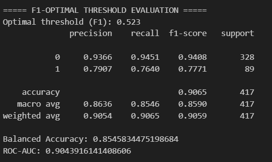
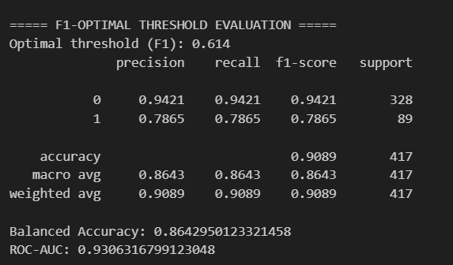
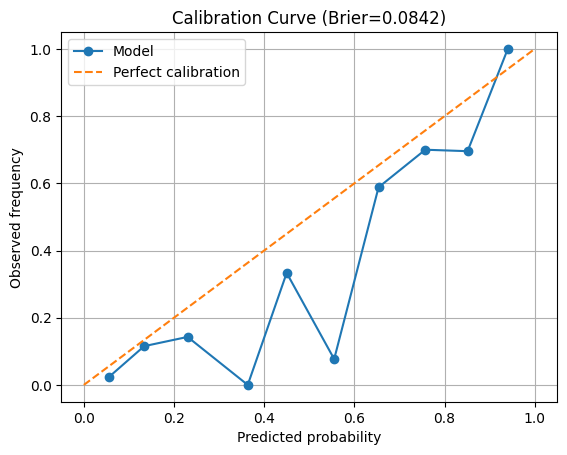
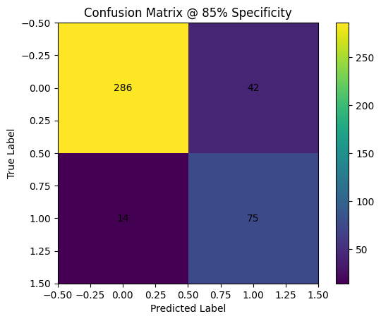
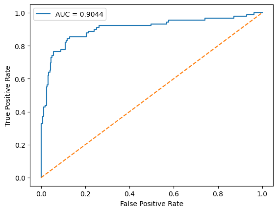
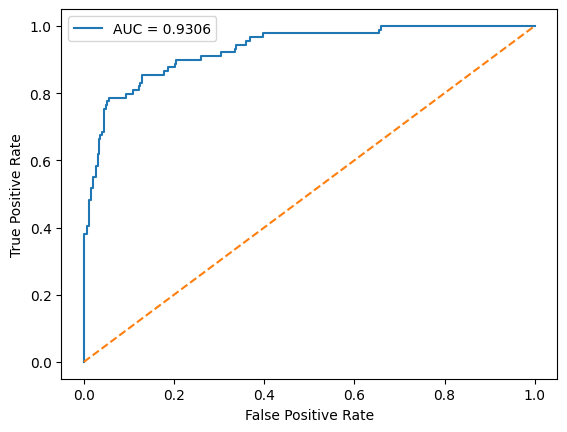
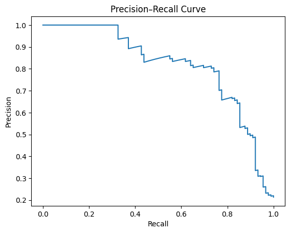
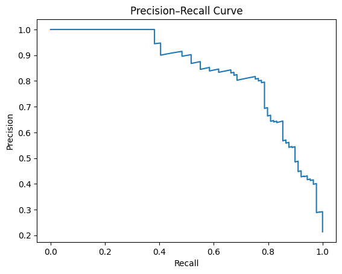

## Model Results

### NOTE : 
 Model 1 -Gated Attention [Trained upto 15 epochs]

 Model 2 -MultiHead Attention  [Trained upto 15 epochs]

---
## Performance Summary

| Metric            | Model 1 | Model 2 |
|-------------------|--------|--------|
| Optimal Threshold | 0.52   | 0.61   |
| Accuracy          | 0.9065 | 0.9089 |
| Balanced Accuracy | 0.8545 | 0.8642 |
| ROC-AUC           | 0.9043 | 0.9306 |
| Sensitivity   | 0.8427 | 0.8427 |
| Specificity   | 0.8719 | 0.8719 |

---

### Classification Reports

#### Model 1

#### Model 2

---

### ===== CLINICAL OPERATING POINT =====
Target specificity: 85%

Operating threshold: 0.376

Sensitivity @ 85% spec: 0.854

Precision @ clinical point: 0.6410256410256411

### ===== CLINICAL OPERATING POINT =====
Target specificity: 85%

Operating threshold: 0.402

Sensitivity @ 85% spec: 0.854

Precision @ clinical point: 0.6410256410256411

--- 

### ===== CALIBRATION =====

## Model 1

Brier score: 0.0861

## Model 2

Brier score: 0.0842

---

###  Confusion Matrices

#### Model 1

#### Model 2

---

###  ROC-AUC Curve Comparison

#### Model 1

#### Model 2

---

###  Precision-Recall Curve Comparison

#### Model 1

#### Model 2

