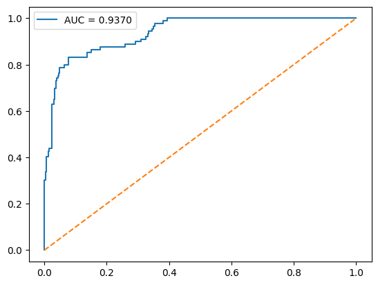
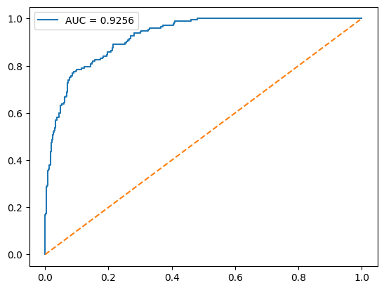
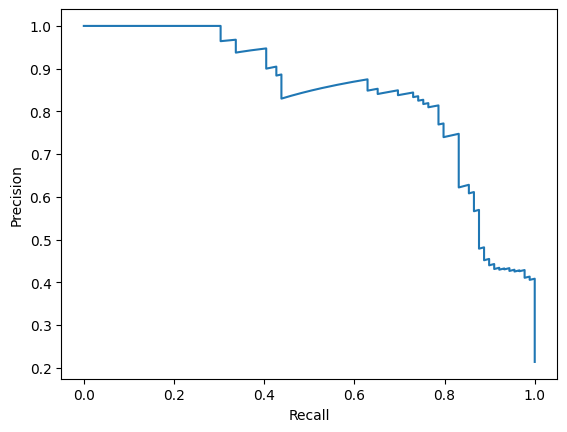

## Model Results

### NOTE : 
 Model 1 - 90/10 split [Trained upto 5 epochs]

 Model 2 - 80/20 split [Trained upto 10 epochs]

---
## Performance Summary

| Metric            | Model 1 | Model 2 |
|-------------------|--------|--------|
| Optimal Threshold | 0.75   | 0.69   |
| Accuracy          | 0.9137 | 0.8848 |
| Balanced Accuracy | 0.8674 | 0.8361 |
| ROC-AUC           | 0.9370 | 0.9256 |
| Sensitivity   | 0.7865 | 0.7514 |
| Specificity   | 0.9482 | 0.9207 |

---

### Classification Reports

#### Model 1

#### Model 2

---

###  Confusion Matrices

#### Model 1

#### Model 2

---

###  ROC-AUC Curve Comparison

#### Model 1

#### Model 2

---

###  Precision-Recall Curve Comparison

#### Model 1

#### Model 2

---

### Sample test result

<table border="3">
  <thead>
    <tr>
      <th>Test File</th>
      <th>File Source</th>
      <th>Expected Output</th>
      <th>Model 1 Output</th>
      <th>Model 2 Output</th>
    </tr>
  </thead>
  <tbody>
    <tr><td>test_1</td><td>physionet_valid</td><td>Absent</td><td>Absent</td><td>Present</td></tr>
    <tr><td>test_2</td><td>physionet_valid</td><td>Present</td><td>Absent</td><td>Absent</td></tr>
    <tr><td>test_3</td><td>circor</td><td>Absent</td><td>Absent</td><td>Absent</td></tr>
    <tr><td>test_4</td><td>circor</td><td>Present</td><td>Absent</td><td>Present</td></tr>
    <tr><td>test_5</td><td>cmds</td><td>Absent</td><td>Present</td><td>Present</td></tr>
    <tr><td>test_6</td><td>cmds</td><td>Present</td><td>Present</td><td>Present</td></tr>
    <tr><td>test_7</td><td>pascal<td>Present</td><td>Present</td><td>Present</td></tr>
    <tr><td>test_8</td><td>pascal</td><td>Absent</td><td>Present</td><td>Present</td></tr>
    <tr><td>test_9</td><td>physionet_training</td><td>Absent</td><td>Present</td><td>Absent</td></tr>
    <tr><td>test_10</td><td>physionet_training</td><td>Present</td><td>Present</td><td>Present</td></tr>
  </tbody>
</table>

### Test Performance
| Metric    | Model 1 | Model 2 |
|-----------|--------|--------|
| Accuracy  | 0.50   | 0.60   |
| Precision | 0.50   | 0.57   |
| Recall    | 0.60   | 0.80   |
| F1-score  | 0.55   | 0.67   |
